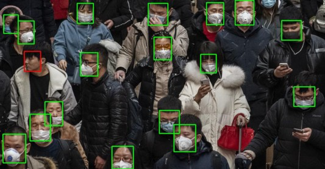

# Mask Detection

 

## Details about this repo

Please read my article [here](https://medium.com/p/b30f138b0bc3/edit), which has explanation about how this is working and how it can be improved further

## How To Use
* Clone this repo.
* Create the conda environment using the following command :
```
conda env create -n social_distancing -f environment.yml
```
* Activate the conda environment using the following command:
```
conda activate social_distancing
```
* Now you have to run the python file run.py with arguments video-path and save-path those indicate the location of the video you want to infer on and the location of the output you want to save in, respectively. You have to run the command :
```
python run.py --video-path 'location of video' --save-path 'save location with output video name'

```
